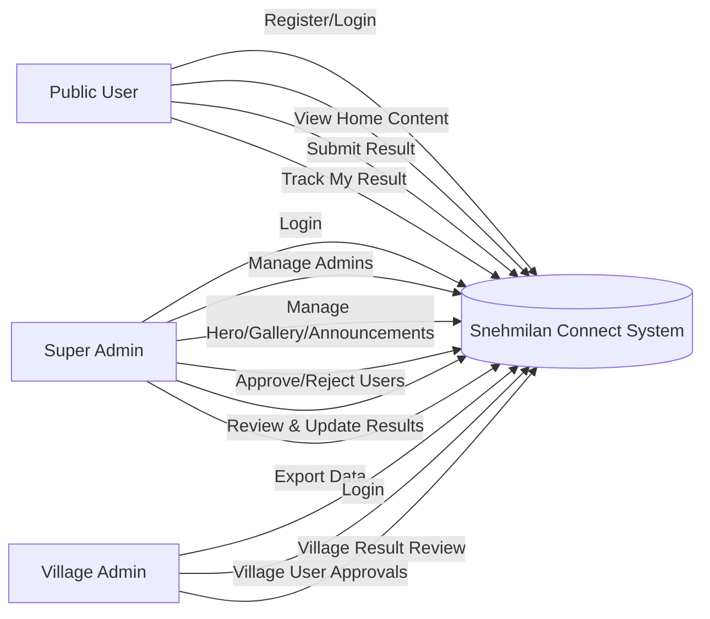
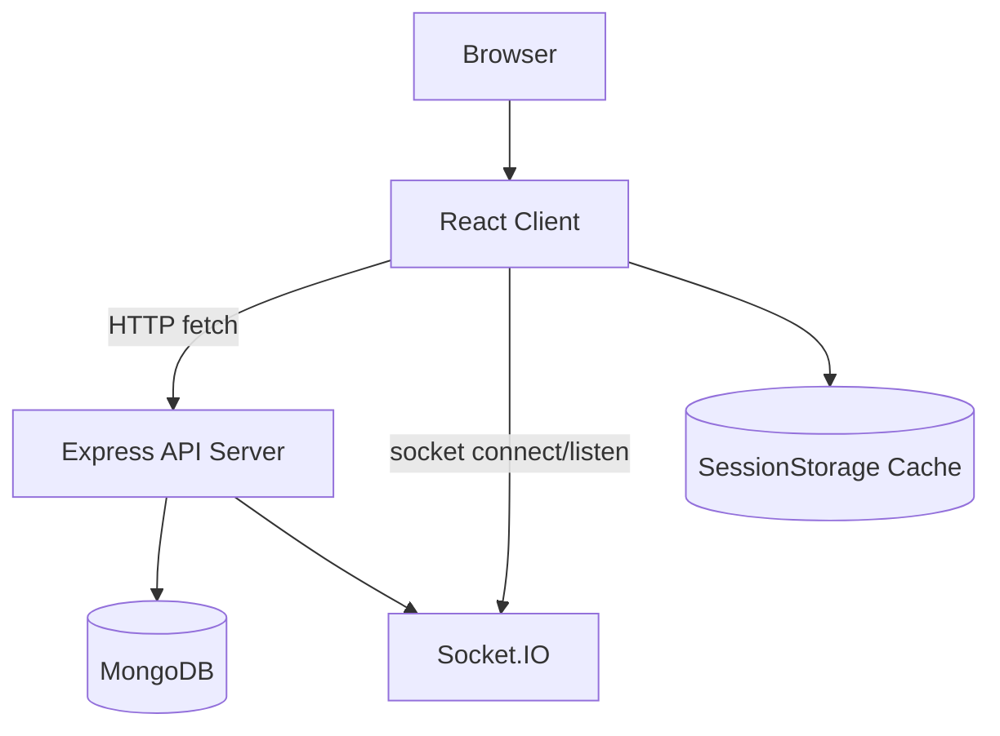
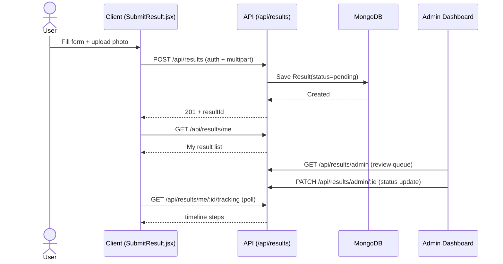
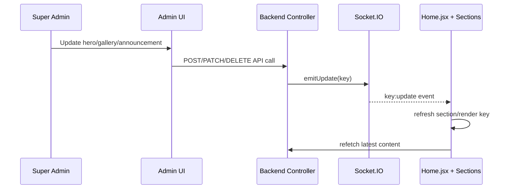
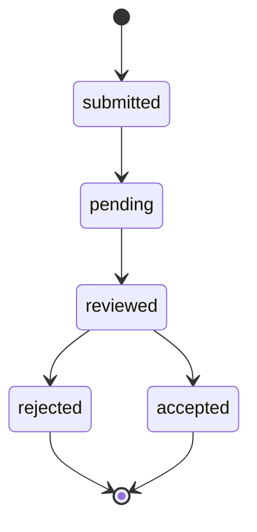

# Dholakiya Snehmilan Connect: Complete Workflow Guide

This document explains the project end-to-end:
- Which file does what (frontend + backend).
- Which API is called from where.
- User/admin workflows.
- Realtime update behavior.
- Diagrams for use cases and execution flow.

---

## 1. System Overview

This project has two main apps:
- `Client` (React + Vite): public website + admin UI.
- `Server` (Node.js + Express + MongoDB): authentication, result workflows, content management APIs, export, realtime updates.

High-level behavior:
1. Public users register/login and submit results.
2. Super Admin and Village Admin review/manage results and users.
3. Super Admin manages hero, gallery, announcements, admins, approval settings, and exports.
4. Backend emits realtime socket events when home content/admin-session state changes.
5. Frontend listens to events and refreshes relevant UI sections.

---

## 2. Frontend File Responsibilities (Client)

## 2.1 App Bootstrap and Routing
- `Client/src/main.jsx`
  - React root mount.
  - Wraps app with `BrowserRouter`.
  - Installs session manager (`installSessionManager`) for token refresh flow.

- `Client/src/App.jsx`
  - Main route table for public and admin routes.
  - Lazy-loads pages/components.
  - Shows boot/suspense loader.
  - Hides navbar for `/admin/*`.
  - AdminRoute guard checks role/token for admin pages.

## 2.2 Public Pages and Sections
- `Client/src/pages/Home.jsx`
  - Composes homepage sections: Intro, Hero, Announcements, Gallery, About, Footer.
  - Uses deferred section loading.
  - Listens to socket events (`hero:update`, `gallery:update`, `announcements:update`) and refreshes section keys.

- `Client/src/components/Navbar.jsx`
  - Top navigation, active-section detection, scroll-to-section behavior.
  - Profile/logout menu.
  - Announcement badge via `/api/announcements`.
  - Announcement realtime badge refresh.

- `Client/src/components/HeroSlider.jsx`
  - Public hero slider view.
  - Fetches `/api/hero`.
  - Uses session cache (`apiCache.js`) to reduce repeated fetches.

- `Client/src/components/AnnouncementSection.jsx`
  - Public announcements listing and pagination.
  - Fetches `/api/announcements`.
  - Uses session cache (`apiCache.js`).
  - Listens for `announcements:update`.

- `Client/src/components/GallerySection.jsx`
  - Public gallery listing, filters, pagination, lightbox.
  - Fetches `/api/gallery`.
  - Uses session cache (`apiCache.js`).
  - Listens for `gallery:update`.

- `Client/src/components/AboutSection.jsx`
  - Static committee/members content and tabs.

- `Client/src/components/SubmitResult.jsx`
  - Result submission form for user and admin modes.
  - Handles:
    - form validation,
    - result create,
    - my-results polling,
    - result-tracking polling,
    - success/submit-another behavior.
  - Supports admin-mode role-based behavior.

## 2.3 Public Auth Pages
- `Client/src/pages/Register.jsx`: user registration.
- `Client/src/pages/Login.jsx`: login and token/session setup.
- `Client/src/pages/ForgotPassword.jsx`: OTP request/reset password.

## 2.4 Admin Pages
- `Client/src/pages/admin/AdminLogin.jsx`
  - Admin login flow (super/village role-based redirect).

- `Client/src/pages/admin/SuperAdminDashboard.jsx`
  - Main super admin dashboard.
  - Loads admin summary, admins, result list views.

- `Client/src/pages/admin/VillageAdminDashboard.jsx`
  - Village admin dashboard.
  - Pending users and village-scoped results operations.

- `Client/src/pages/admin/SuperQuickActionsPage.jsx`
  - Super admin operations in one page:
    - admin CRUD,
    - approval settings,
    - pending users approve/reject,
    - announcement/gallery/hero CRUD,
    - export preview/export.

- `Client/src/pages/admin/SuperResultDetail.jsx`
- `Client/src/pages/admin/VillageResultDetail.jsx`
  - Single result detail and status update workflows.

## 2.5 Shared Frontend Utilities and Context
- `Client/src/utils/auth.js`: user auth token/profile helpers.
- `Client/src/utils/adminAuth.js`: admin token/profile helpers.
- `Client/src/utils/sessionManager.js`: refresh token/session renewal flow.
- `Client/src/utils/realtime.js`: socket client singleton.
- `Client/src/utils/logout.js`: role-aware logout helpers.
- `Client/src/utils/apiCache.js`: sessionStorage cache helper (TTL-based).
- `Client/src/context/AdminDataContext.jsx`: admin-level shared data fetch/store.
- `Client/src/hooks/useAdminInactivityLogout.js`: auto-logout on inactivity.

---

## 3. Backend File Responsibilities (Server)

## 3.1 Entry and App Composition
- `Server/server.js`
  - Loads env, connects DB, creates HTTP + Socket.IO server, starts listening.
  - Registers socket instance via `setIO`.

- `Server/app.js`
  - Express app middleware setup: CORS, JSON parser, logging, headers.
  - Static uploads path.
  - Mounts all API routes under `/api/*`.
  - 404 and centralized error handlers.

## 3.2 Routes
- `Server/src/routes/auth.js`: registration/login/session/admin/user-approval endpoints.
- `Server/src/routes/results.js`: submit result, my results, tracking, admin result operations.
- `Server/src/routes/announcements.js`: public/admin announcement endpoints.
- `Server/src/routes/gallery.js`: public/admin gallery endpoints.
- `Server/src/routes/hero.js`: public/admin hero endpoints.
- `Server/routes/export.js`: super-admin export endpoints.
- `Server/src/routes/proxy.js`: input-tools proxy route.
- `Server/src/routes/schools.js`: school endpoints.

## 3.3 Controllers
- `Server/src/controllers/authController.js`
  - Auth + refresh-token sessions.
  - OTP-based forgot password.
  - Admin CRUD and presence/heartbeat.
  - User approval queue and settings.
  - Emits `admin-session:update`.

- `Server/src/controllers/resultController.js`
  - Result submission + validation rules.
  - My results and timeline tracking.
  - Admin result list/detail/update/summary.
  - OCR extraction endpoint for photo.

- `Server/src/controllers/announcementController.js`
  - Announcement CRUD + active/public filtering.
  - Emits `announcements:update`.

- `Server/src/controllers/galleryController.js`
  - Gallery CRUD.
  - Emits `gallery:update`.

- `Server/src/controllers/heroController.js`
  - Hero slide CRUD.
  - Emits `hero:update`.

- `Server/controllers/exportController.js`
  - Filter options, preview, and file export workflows.

## 3.4 Models and Services
- Models:
  - `User`, `RefreshToken`, `ApprovalSetting`, `Result`, `Announcement`, `GalleryImage`, `HeroSlide`, `School`.
- Services:
  - `Server/src/services/realtime.js`
    - `emitUpdate(key)` emits `${key}:update` socket events.
  - `Server/src/services/mailService.js`
    - OTP email delivery.
- Middleware:
  - `auth.js` for token and role guards.
  - `rateLimit.js` for auth abuse protection.
  - `upload.js` for multer upload processing.

---

## 4. API Inventory and Caller Map (Frontend -> Backend)

## 4.1 Auth APIs
- `POST /api/auth/register`
  - Called from: `Client/src/pages/Register.jsx`
  - Use: user signup.

- `POST /api/auth/login`
  - Called from: `Client/src/pages/Login.jsx`, `Client/src/pages/admin/AdminLogin.jsx`
  - Use: user/admin login.

- `POST /api/auth/refresh`
  - Called from: `Client/src/utils/sessionManager.js`
  - Use: refresh access token.

- `POST /api/auth/logout`
  - Called from: `Client/src/utils/logout.js`, `Client/src/hooks/useAdminInactivityLogout.js`
  - Use: user logout.

- `POST /api/auth/admins/logout`
  - Called from: `Client/src/components/admin/AdminShell.jsx`, `Client/src/utils/logout.js`, `Client/src/hooks/useAdminInactivityLogout.js`
  - Use: admin logout + presence update.

- `POST /api/auth/forgot-password/request-otp`
  - Called from: `Client/src/pages/ForgotPassword.jsx`
  - Use: request OTP.

- `POST /api/auth/forgot-password/reset`
  - Called from: `Client/src/pages/ForgotPassword.jsx`
  - Use: reset password by OTP.

- `GET /api/auth/me`
  - Called from: `Client/src/components/SubmitResult.jsx`
  - Use: account status check.

## 4.2 Result APIs
- `POST /api/results`
  - Called from: `Client/src/components/SubmitResult.jsx`
  - Use: submit result form.

- `GET /api/results/me`
  - Called from: `Client/src/components/SubmitResult.jsx`
  - Use: user’s submitted results list.

- `GET /api/results/me/:id/tracking`
  - Called from: `Client/src/components/SubmitResult.jsx`
  - Use: timeline/status tracking.

- `GET /api/results/admin`, `/admin/list`, `/admin/summary`, `/admin/:id`, `PATCH /admin/:id`
  - Called from: admin dashboards/pages (`SuperAdminDashboard.jsx`, detail pages).
  - Use: admin-level result operations.

- `POST /api/results/extract`
  - Called from: OCR helper flows (if used from UI integration).
  - Use: text extraction from uploaded marksheet image.

## 4.3 Home Content APIs
- `GET /api/hero`
  - Called from: `Client/src/components/HeroSlider.jsx`
  - Use: public hero slider content.

- `GET /api/announcements`
  - Called from: `Client/src/components/AnnouncementSection.jsx`, `Client/src/components/Navbar.jsx`
  - Use: public announcements + unread badge.

- `GET /api/gallery`
  - Called from: `Client/src/components/GallerySection.jsx`
  - Use: public gallery content.

## 4.4 Admin Content Management APIs
- Announcements:
  - `GET /api/announcements/admin`, `POST /api/announcements`, `PATCH /api/announcements/:id`, `DELETE /api/announcements/:id`
  - Called from: `Client/src/pages/admin/SuperQuickActionsPage.jsx`

- Gallery:
  - `POST /api/gallery`, `PATCH /api/gallery/:id`, `DELETE /api/gallery/:id` (+ list)
  - Called from: `Client/src/pages/admin/SuperQuickActionsPage.jsx`

- Hero:
  - `GET /api/hero/admin`, `POST /api/hero`, `PATCH /api/hero/:id`, `DELETE /api/hero/:id`
  - Called from: `Client/src/pages/admin/SuperQuickActionsPage.jsx`

## 4.5 Admin/User Management APIs
- Admin management:
  - `GET/POST/PATCH/DELETE /api/auth/admins*`
  - Called from: `Client/src/pages/admin/SuperQuickActionsPage.jsx`

- User approvals:
  - `GET /api/auth/users/pending`
  - `PATCH /api/auth/users/:id/approve`
  - `PATCH /api/auth/users/:id/reject`
  - `POST /api/auth/users/bulk-approve`
  - Called from: `SuperQuickActionsPage.jsx`, `VillageAdminDashboard.jsx`

- Approval settings:
  - `GET /api/auth/approval-settings`
  - `PATCH /api/auth/approval-settings/global`
  - `PATCH /api/auth/approval-settings/village`
  - Called from: `SuperQuickActionsPage.jsx`

## 4.6 Export APIs
- `GET /api/export/filter-options`
- `POST /api/export/preview`
- `POST /api/export/results`
- Called from: `Client/src/pages/admin/SuperQuickActionsPage.jsx`, `Client/src/components/admin/ExportResultModal.jsx`

---

## 5. Realtime Events and Trigger Points

Backend emits:
- `hero:update` from hero controller on create/update/delete.
- `gallery:update` from gallery controller on create/update/delete.
- `announcements:update` from announcement controller on create/update/delete.
- `admin-session:update` from auth controller for admin presence/session changes.

Frontend listeners:
- `Home.jsx`: listens to hero/gallery/announcements update events to refresh sections.
- `HeroSlider.jsx`, `GallerySection.jsx`, `AnnouncementSection.jsx`, `Navbar.jsx`: section-specific refresh/listener usage.
- `AdminShell.jsx`: listens to `admin-session:update`.

---

## 6. Core Workflows

## 6.1 Public User Flow
1. User visits Home.
2. Home sections fetch public content.
3. User registers/logs in.
4. User submits result from announcement CTA or direct submit page.
5. User tracks status timeline (`pending/reviewed/accepted/rejected`).

## 6.2 Super Admin Flow
1. Admin login.
2. Dashboard loads admin stats/results/admins.
3. Can review/update result status and reject notes.
4. Can manage content (hero/gallery/announcements).
5. Can manage admins and user approvals.
6. Can export result data.

## 6.3 Village Admin Flow
1. Admin login as village role.
2. Access limited village-scoped result/user approval data.
3. Approve/reject pending users and review village results only.

---

## 7. Diagrams

## 7.1 Use Case Diagram

## 7.2 Architecture Diagram

## 7.3 Result Submission Sequence

## 7.4 Home Content Realtime Refresh

## 7.5 Result Status State Diagram

---

## 8. Notes for Future Maintenance

- Keep all API base URLs through `import.meta.env.VITE_API_URL`.
- Keep auth/session logic centralized in `auth.js`, `adminAuth.js`, `sessionManager.js`.
- Emit realtime events in backend whenever content affecting home/admin live views changes.
- For performance, prefer cache + selective refresh over hard reload.
- When adding a new module, update:
  1. route registration in `Server/app.js`,
  2. frontend caller map in this document,
  3. relevant sequence/use-case diagrams (if workflow changes).

